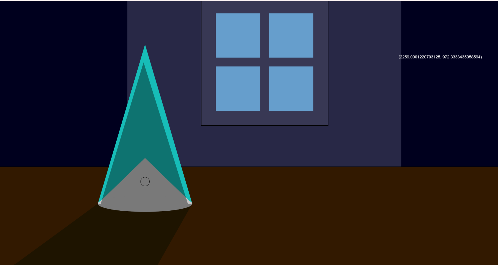
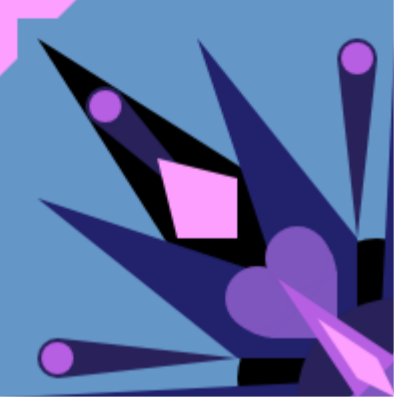

# :large_blue_diamond: **CART 253 Creative Computation Project** :large_blue_diamond:

Author: :star2: **Yannick Hantaniaina** :star2:[^1]

[^1]: I know I'm sorry it's a lame title but I will update it when I know what kind of interface/game I am going to make. On the meantime I drew this pretty image as a banner for compensation.

## :small_blue_diamond: Description

This website is a portfolio-like platform where I share my *Creative Computation Class Project*.

| Tool | Purpose |
| :----------- | :----------- |
| Markdown | Informational page for future user  |
| p5.js  | Prototyping and Building | 
| HTML | Design Interface |
| Procreate | Banner & Assets Design | 

> I am hoping to share my weekly progress and a Journal to document my journey. Most likely, this Description will be changed into something more concrete once I come to an actual idea of the game/User interface I would like to achieve. In the meantime, enjoy my **PRETTY** banner and my markdown learning journey for now. Below, I will be sharing a link to my devpost with my ~~outdated~~ artstation portfolio ~~and my linkedin~~.[^2]

[^2]: I don't currently have much link to put here. Chat is this larping at its peak ?

---
## :small_blue_diamond: Links 

1. **[Devpost](https://devpost.com/yannickhantaniaina?ref_content=user-portfolio&ref_feature=portfolio&ref_medium=global-nav)**

2. **[ArtStation](https://www.artstation.com/altastrida)**
3. **[LinkedIn](https://www.linkedin.com/in/yannick-hantaniaina)**
4. **[Reflective Journal](./journal.md)**

---
## Prototyping: Instructions 
1. **Prototype 1: Coco's Witch Hat**
    - [Code] (./prototyping-instructions/prototype-1/)
    - [Running Prototype](https://yannickhhn.github.io/cart253/prototyping-instructions/prototype-1/index.html)
    

2. **Prototype 2: Kaleidoscope Tile** 
    - [Code](./prototyping-instructions/prototype-2/)
    - [Running Prototype] (https://yannickhhn.github.io/cart253/prototyping-instructions/prototype-2/index.html)
    
    
3. **Prototype 3 : Exquisite Body**
    - [Code](./prototyping-instructions/prototype-3/)**
    - [Running Prototype](https://yannickhhn.github.io/cart253/prototyping-instructions/prototype-3/index.html)
    

    **Journal Entry**: [Prototyping: Instructions](./journal.md#prototypinginstructions)

---
## Prototyping: Variables
1. **Prototype 1**
    - [Code](./prototyping-variables/var-prototype-1/)**
    - [Running prototype](https://yannickhhn.github.io/cart253/prototyping-variables/prototype-1/index.html)
    

1. **Prototype 2**
    - [Code](./prototyping-variables/var-prototype-2/)**
    - [Running prototype](https://yannickhhn.github.io/cart253/prototyping-variables/prototype-2/index.html)
    

3. 1. **Prototype 3**
    - [Code](./prototyping-variables/var-prototype-3/)**
    - [Running prototype](https://yannickhhn.github.io/cart253/prototyping-variables/prototype-3/index.html)
    

    **Journal Entry**: [Prototyping : Variables](./journal.md#prototypingvariables)

--- 
## :small_blue_diamond: License 

> 