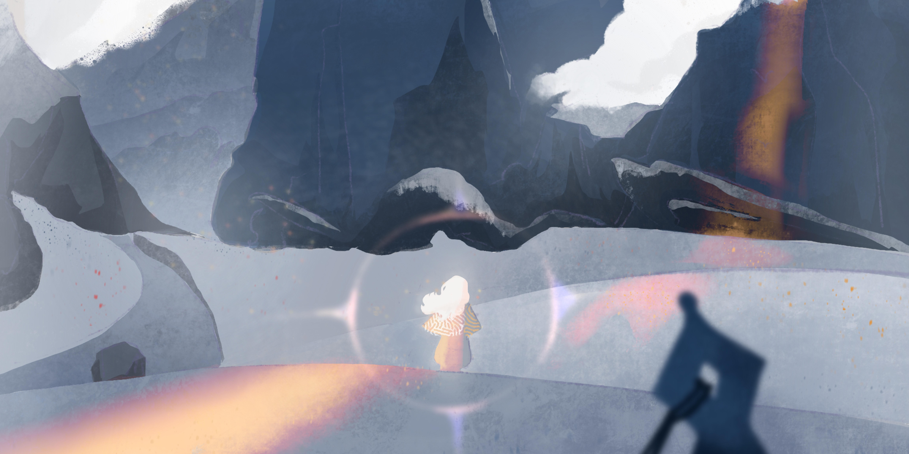
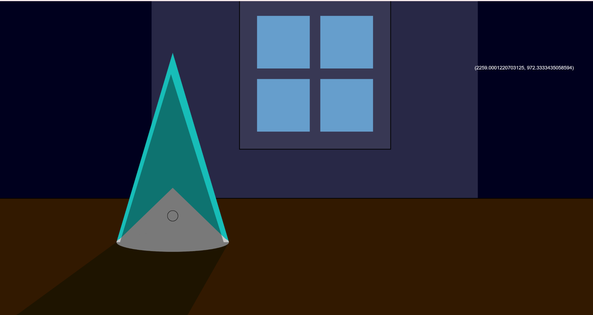
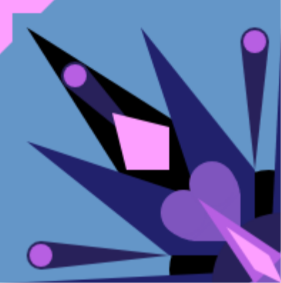
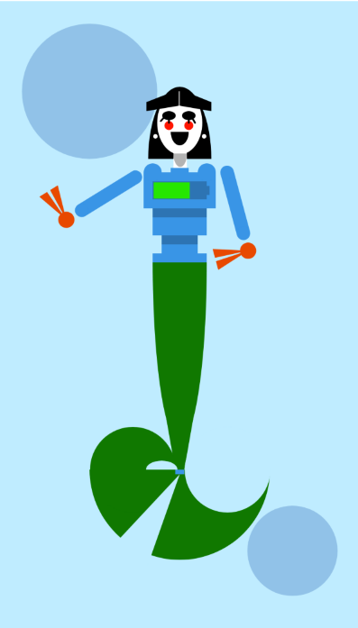
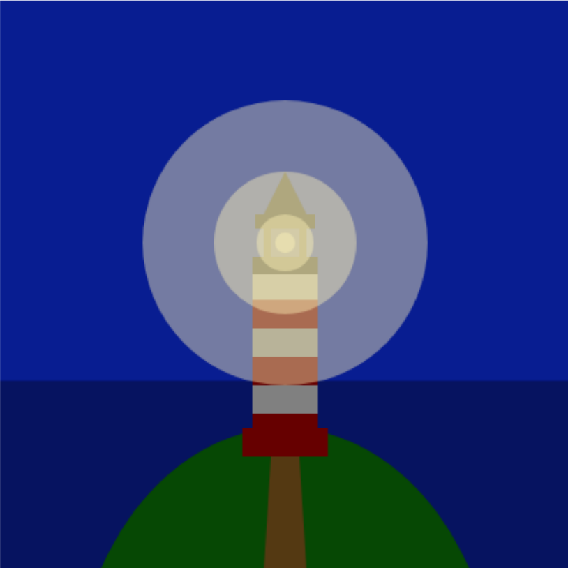
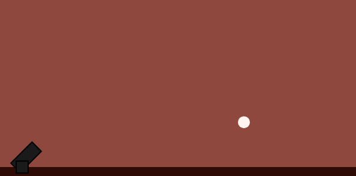
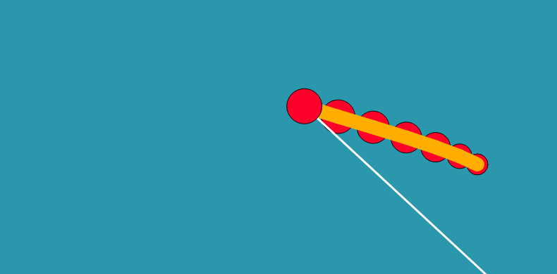
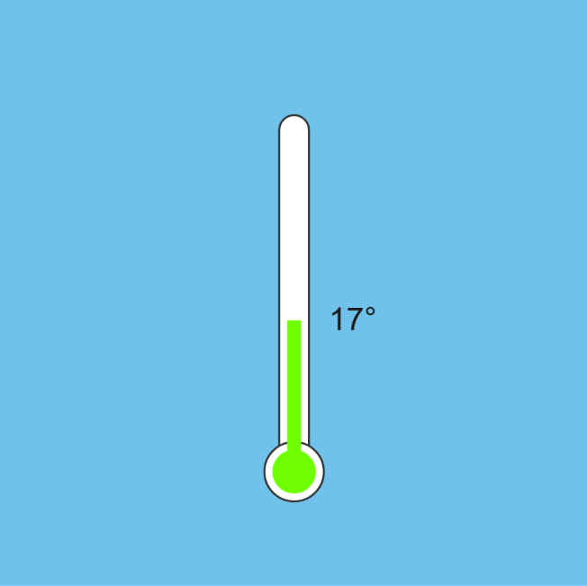

# :large_blue_diamond: **CART 253 Creative Computation Project** :large_blue_diamond:

Author: :star2: **Yannick Hantaniaina** :star2:[^1]

[^1]: I know I'm sorry it's a lame title but I will update it when I know what kind of interface/game I am going to make. On the meantime I drew this pretty image as a banner for compensation.

## :small_blue_diamond: Description

This website is a portfolio-like platform where I share my *Creative Computation Class Project*.

| Tool | Purpose |
| :----------- | :----------- |
| Markdown | Informational page for future user  |
| p5.js  | Prototyping and Building | 
| HTML | Design Interface |
| Procreate | Banner & Assets Design | 

> I am hoping to share my weekly progress and a Journal to document my journey. Most likely, this description will be changed into something more concrete once I come to an actual idea of the game/User interface I would like to achieve.

[^2]: I don't currently have much link to put here. Chat is this larping at its peak ?

---
## :small_blue_diamond: Links 

1. **[Devpost](https://devpost.com/yannickhantaniaina?ref_content=user-portfolio&ref_feature=portfolio&ref_medium=global-nav)**

2. **[ArtStation](https://www.artstation.com/altastrida)**
3. **[LinkedIn](https://www.linkedin.com/in/yannick-hantaniaina)**
4. **[Reflective Journal](./journal.md)**

---
## Prototyping: Instructions

1. **Prototype 1: Coco's Witch Hat**
    - [Code](./prototyping-instructions/prototype-1/)
    - [Running Prototype](https://yannickhhn.github.io/cart253/prototyping-instructions/prototype-1/index.html)

    

2. **Prototype 2: Kaleidoscope Tile**
    - [Code](./prototyping-instructions/prototype-2/)
    - [Running Prototype](https://yannickhhn.github.io/cart253/prototyping-instructions/prototype-2/index.html)

    

3. **Prototype 3: Exquisite Body**
    - [Code](./prototyping-instructions/prototype-3/)
    - [Running Prototype](https://yannickhhn.github.io/cart253/prototyping-instructions/prototype-3/index.html)

    

**Journal Entry**: [Prototyping: Instructions](./journal.md#prototypinginstructions)

---
## Prototyping: Variables

1. **Prototype 1 : Lighthouse on a Hill**
    - [Code](./prototyping-variables/var-prototype-1/js/script.js)
    - [LightHouse](https://yannickhhn.github.io/cart253/prototyping-variables/var-prototype-1/index.html)

    

2. **Prototype 2 : Cannon Launch**
    - [Code](./prototyping-variables/var-prototype-2/js/script.js)
    - [Cannon](https://yannickhhn.github.io/cart253/prototyping-variables/var-prototype-2/index.html)

    

3. **Prototype 3**
    - [Code](./prototyping-variables/var-prototype-3/js/script.js)
    - [Dragon Kite](https://yannickhhn.github.io/cart253/prototyping-variables/var-prototype-3/index.html)

    
    
**Journal Entry**: [Prototyping: Variables](./journal.md#prototypingvariables)

---
## Prototyping: Conditionals

1. **Prototype 1 : Night/Day Switch**
    - [Code](./prototyping-conditionals/conditional-p1/index.html)
    - [Running Prototype](https://yannickhhn.github.io/cart253/prototyping-conditionals/conditional-p1/index.html)

2. **Prototype 2 : Platform**
    - [Code](./prototyping-conditionals/conditional-p2/index.html)
    - [Running Prototype](https://yannickhhn.github.io/cart253/prototyping-conditionals/conditional-p2/index.html)

    

3. **Prototype 3 :Thermometer**
    - [Code](./prototyping-conditionals/conditional-p3/index.html)
    - [Running Prototype](https://yannickhhn.github.io/cart253/prototyping-conditionals/conditional-p3/index.html)

    

**Journal Entry**: [Prototyping: Variables](./journal.md#prototypingconditionals)

---
## :small_blue_diamond: License 

> 