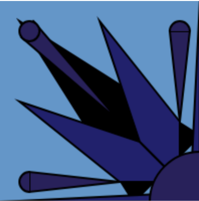
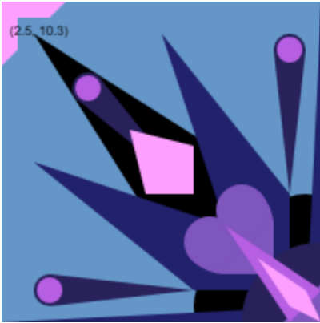

# :purple_heart: Reflective Journal :purple_heart: 
---
- [ ] Come up with Project Idea
- [ ] Update ReadMe title
- [ ] Update Description 
- [ ] Update Media Content in Description and Links 
- [ ] Write Licenses if Applicable 
- [ ] Write Journal as you go

--- 

## 12th September 2026
- I started working on the first Assignment **Prototyping: Website**
- I think the professor gave a README.md template but since I'm super new with markdown, ~~it kind of looks disorganized in VSC so~~ i started with just a basic heading lists of what was required on the assignment (bleh)
- I might be doing this in one day am i losing mark for a non-multiple day repo commits ?????? anywayns

So I was struggling to make the formatting appear in Github and i spent about 30 minutes trying to figure it out. Well I just learned that any text with 3< indent is considered a line of code in Markdown. It probably wasn't in the cheat cheet :heart: 

I also learned at the same time that I needed to upload my assets in the repo in order to implement images in my repo. At first I imported my local file path and i was really confused until i googled it haha ha :bust_in_silhouette:. I probably should have know this if I read the Discord Server or paid a little more attention to the assignment instructions.

I think I am getting a hang of it *sobs*

I am pretty confortable with VSC so far since i have used it before. There were inconsistencies on the Markdown preview functionality on VSC and my actual Github Repo, and I kind of had to commit to see where the issue is. This probably messed up with my version control a little bit and how unnecessary some commits were. 

Markdown is pretty fun to write on especially if I want to make funny stuff. I wanted to add more colors though and apparently need html? I saw someone ask that on the discord and i wanna wait for an answer. 

I am trying to add gif to make it look more fun. I searched up and Gif uses the same format as an image. This time I didn't download it but immediately used a link on the web. It currently doesn't work on the preview eventhough I used the correct formatting? I only can see it through commits

I think I am done with the general assignment requirements for now (12 PM) but I will polish things up so it looks pretty. I'm scared i didn't reach the minimum creativity required D: 

Okay so gif from the web didn't work so I huh I imported a gif on the repo :family:
I also updated to add tables and some stuff hehe. 

I forgor to do process screenshot :sob: The history of commits can probably still be seen. Here are some of this version of Website for now

--- 

## Prototyping:Instructions

# 18th September 2026 - 

I am starting the second assignment about prototyping-instructions. Tbf with you all, I am confused as hell and really wish there was an example on the repo or a little summary.

OHHHH I AM SUPPOSED TO DRAW REPRESENTATIONAL, DRAW ABSTRACT AND THEN DRAW SOMETHING WEIRD oml :wilted_flower:

For prototype 1, I decided to draw Coco’s hat from Witch Hat Atelier. I wanted something relatively simple but detailed enough to explore the topic. I also used a larger canvas to challenge myself with scale and element placement, which was difficult during the in-class challenge.

# 20th September 2026 -
I continued working on the witch hat. I’m very used to drawing digitally, so drawing with code felt tedious at first. I finished the first hat, added background details and shadows, and learned how to display mouse coordinates, which made my workflow MUCH faster.

I also realized that we were only supposed to explore things covered in class, so I decided prototype 1 was done. I feel more confident with geometric shapes now.

# 21th September 2026 -

For prototype 2, I wanted to put form into form in a kaleidoscopic-looking illustration. I experimented with duplicating the canvas and different colours. I also ran into a bunch of bugs and had to restart my code, but thankfully figured it out.

I planned to manipulate the image into an actual kaleidoscope, but realized image importation was beyond the scope of the assignment.

# 22th September 2026

Because of time concerns, I decided to move on to prototype 3 instead of restarting prototype 2.

Things are getting much easier and faster. Drawing with code feels more intuitive now. I played around with HSL and the rotate function and feel much more creative after what I learned from P1 and P2. I finished the head and body of my exquisite corpse and will do some final refining.

Finished with the third prototype ! YAY 

