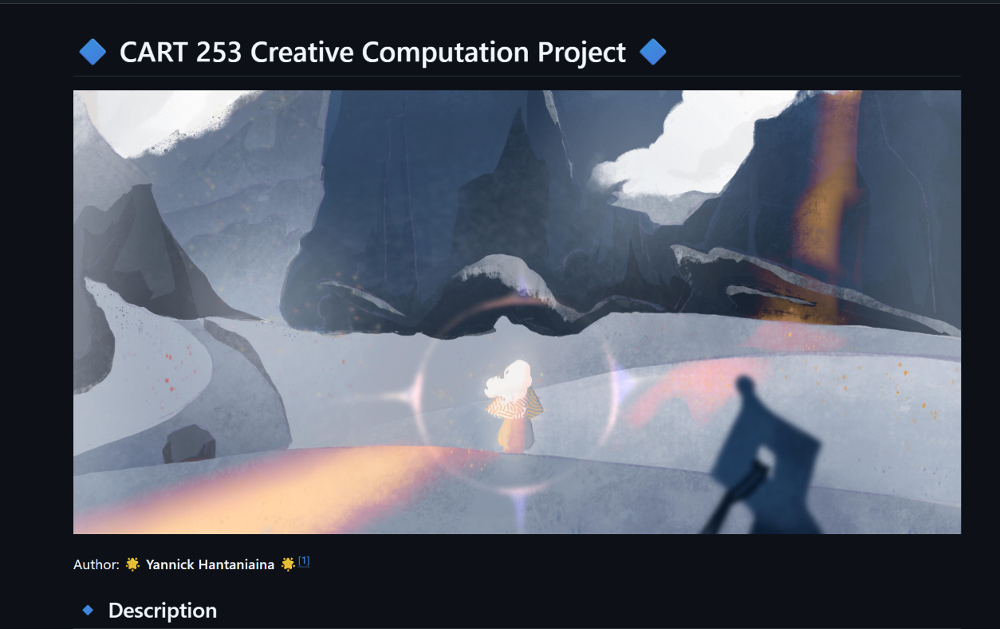
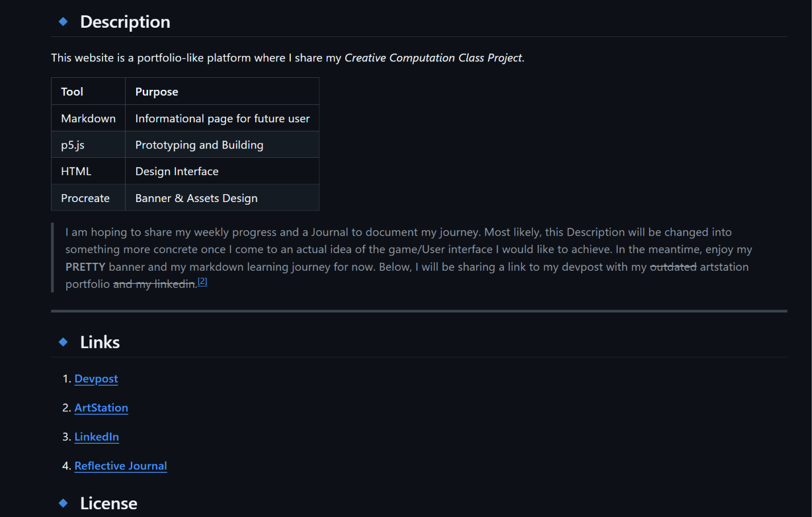
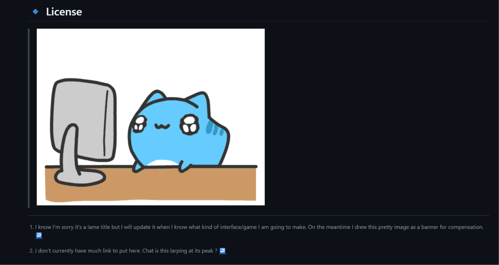

# :purple_heart: Reflective Journal :purple_heart: 
---
- [ ] Come up with Project Idea
- [ ] Update ReadMe title
- [ ] Update Description 
- [ ] Update Media Content in Description and Links 
- [ ] Write Licenses if Applicable 
- [ ] Write Journal as you go

--- 

## 12th September 2026
- I started working on the first Assignment **Prototyping: Website**
- I think the professor gave a README.md template but since I'm super new with markdown, ~~it kind of looks disorganized in VSC so~~ i started with just a basic heading lists of what was required on the assignment (bleh)
- I might be doing this in one day am i losing mark for a non-multiple day repo commits ?????? anywayns

So I was struggling to make the formatting appear in Github and i spent about 30 minutes trying to figure it out. Well I just learned that any text with 3< indent is considered a line of code in Markdown. It probably wasn't in the cheat cheet :heart: 

I also learned at the same time that I needed to upload my assets in the repo in order to implement images in my repo. At first I imported my local file path and i was really confused until i googled it haha ha :bust_in_silhouette:. I probably should have know this if I read the Discord Server or paid a little more attention to the assignment instructions.

I think I am getting a hang of it *sobs*

I am pretty confortable with VSC so far since i have used it before. There were inconsistencies on the Markdown preview functionality on VSC and my actual Github Repo, and I kind of had to commit to see where the issue is. This probably messed up with my version control a little bit and how unnecessary some commits were. 

Markdown is pretty fun to write on especially if I want to make funny stuff. I wanted to add more colors though and apparently need html? I saw someone ask that on the discord and i wanna wait for an answer. 

I am trying to add gif to make it look more fun. I searched up and Gif uses the same format as an image. This time I didn't download it but immediately used a link on the web. It currently doesn't work on the preview eventhough I used the correct formatting? I only can see it through commits

I think I am done with the general assignment requirements for now (12 PM) but I will polish things up so it looks pretty. I'm scared i didn't reach the minimum creativity required D: 

Okay so gif from the web didn't work so I huh I imported a gif on the repo :family:
I also updated to add tables and some stuff hehe. 

I forgor to do process screenshot :sob: The history of commits can probably still be seen. Here are some of this version of Website for now

--- 
