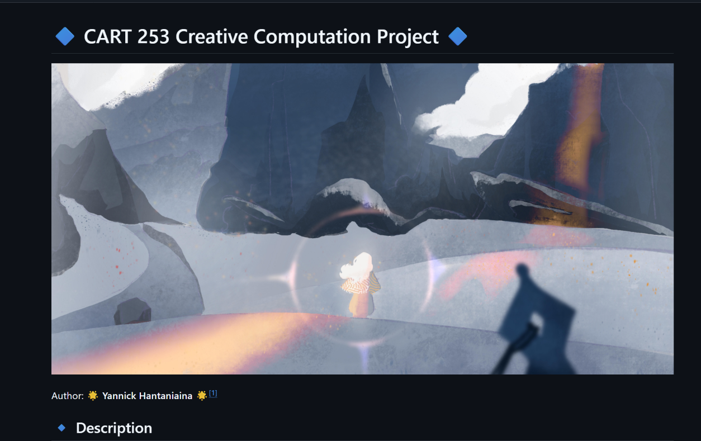
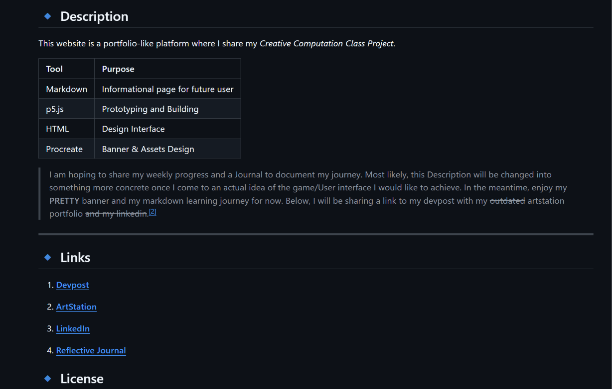
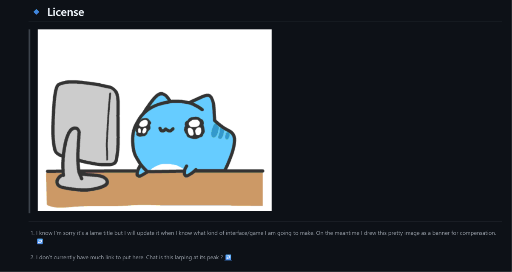
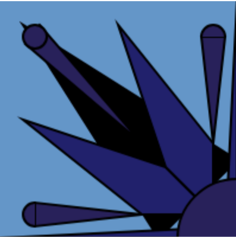
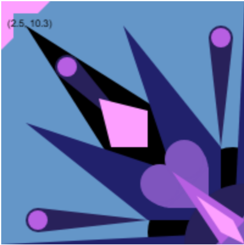

# :purple_heart: Reflective Journal :purple_heart: 
---
- [ ] Come up with Project Idea
- [ ] Update ReadMe title
- [ ] Update Description 
- [ ] Update Media Content in Description and Links 
- [ ] Write Licenses if Applicable 
- [ ] Write Journal as you go

--- 

## 12th September 2026
- I started working on the first Assignment **Prototyping: Website**
- I think the professor gave a README.md template but since I'm super new with markdown, ~~it kind of looks disorganized in VSC so~~ i started with just a basic heading lists of what was required on the assignment (bleh)
- I might be doing this in one day am i losing mark for a non-multiple day repo commits ?????? anywayns

So I was struggling to make the formatting appear in Github and i spent about 30 minutes trying to figure it out. Well I just learned that any text with 3< indent is considered a line of code in Markdown. It probably wasn't in the cheat cheet :heart: 

I also learned at the same time that I needed to upload my assets in the repo in order to implement images in my repo. At first I imported my local file path and i was really confused until i googled it haha ha :bust_in_silhouette:. I probably should have know this if I read the Discord Server or paid a little more attention to the assignment instructions.

I think I am getting a hang of it *sobs*

I am pretty confortable with VSC so far since i have used it before. There were inconsistencies on the Markdown preview functionality on VSC and my actual Github Repo, and I kind of had to commit to see where the issue is. This probably messed up with my version control a little bit and how unnecessary some commits were. 

Markdown is pretty fun to write on especially if I want to make funny stuff. I wanted to add more colors though and apparently need html? I saw someone ask that on the discord and i wanna wait for an answer. 

I am trying to add gif to make it look more fun. I searched up and Gif uses the same format as an image. This time I didn't download it but immediately used a link on the web. It currently doesn't work on the preview eventhough I used the correct formatting? I only can see it through commits

I think I am done with the general assignment requirements for now (12 PM) but I will polish things up so it looks pretty. I'm scared i didn't reach the minimum creativity required D: 

Okay so gif from the web didn't work so I huh I imported a gif on the repo :family:
I also updated to add tables and some stuff hehe. 

I forgor to do process screenshot :sob: The history of commits can probably still be seen. Here are some of this version of Website for now

--- 

## Prototyping:Instructions

### 18th September 2026 - 

I am starting the second assignment about prototyping-instructions. Tbf with you all, I am confused as hell and really wish there was an example on the repo or a little summary.

OHHHH I AM SUPPOSED TO DRAW REPRESENTATIONAL, DRAW ABSTRACT AND THEN DRAW SOMETHING WEIRD oml :wilted_flower:

For prototype 1, I decided to draw Coco’s hat from Witch Hat Atelier. I wanted something relatively simple but detailed enough to explore the topic. I also used a larger canvas to challenge myself with scale and element placement, which was difficult during the in-class challenge.

### 20th September 2026 -
I continued working on the witch hat. I’m very used to drawing digitally, so drawing with code felt tedious at first. I finished the first hat, added background details and shadows, and learned how to display mouse coordinates, which made my workflow MUCH faster.

I also realized that we were only supposed to explore things covered in class, so I decided prototype 1 was done. I feel more confident with geometric shapes now.

### 21th September 2026 -

For prototype 2, I wanted to put form into form in a kaleidoscopic-looking illustration. I experimented with duplicating the canvas and different colours. I also ran into a bunch of bugs and had to restart my code, but thankfully figured it out.

I planned to manipulate the image into an actual kaleidoscope, but realized image importation was beyond the scope of the assignment.

### 22th September 2026

Because of time concerns, I decided to move on to prototype 3 instead of restarting prototype 2.

Things are getting much easier and faster. Drawing with code feels more intuitive now. I played around with HSL and the rotate function and feel much more creative after what I learned from P1 and P2. I finished the head and body of my exquisite corpse and will do some final refining.

Finished with the third prototype ! YAY 

## Prototyping:Variables

### 26th September 2026
I found an idea of what to do with each prototypes. I am starting with Prototype 1.
For prototype 1, I'm making a lighthouse at night with a glowing light that grows and shrinks. I drew the sea, a grassy hill with a little path, and the lighthouse itself, which felt quicker now that I'm used to placing shapes. Using sin() with frameCount to make the light pulse was the fun part! I got stuck on a couple of bugs, like my mouse coordinates leaving a messy trail across the screen, but I figured them out and learned a lot :bulb:

For prototype 2, I made a canon that shoots a ball across the screen in an arc. I gave the ball a velocity and a gravity-like acceleration, which was fun to play with. At first the ball kept appearing in mid-air because it moved way too fast, so I slowed it down and matched its angle to my 45° barrel. Since we can't use conditionals yet, I made the ball wait for a mouse click by multiplying its movement by 0 or 1, huh probably not on the course scope yet but i found it online so :p. I added some html title as instruction.

For prototype 3, I made a dragon that follows the mouse!! I tried a see-through background first but it just looked like a smear :sob: so I made a chain of segments that each lerp() toward the one in front and connected them with thick lines. Moving the mouse fast opened big gaps, and my offset kept the body stuck on a tilt. I looked into fixing it but tbf a kite's tail is tilted anyway so... it's a kite now :kite: Writing every segment without loops was PAINFUL,???

anyways i am done and I honestly took so much less time working on this than the last prototyping assignments. I also have more control over my versions and my readme files. 

## Prototyping:Conditionals

### 3rd October 2026

Started with Conditionals prototype ideas. I'm a bit scared I am ambitious so some changes will come along original ideas to adjust it with the scope we currently have.

For prototype 1, I made a day/night switch! Clicking the little toggle knob flips the scene between a sunny sky with clouds and a night sky with a crescent moon :crescent_moon:. I had sooo many tiny bugs but the big lesson was that I was calling `mousePressed()` inside `draw()`, so the switch worked on hover instead of click. p5 calls it by itself once per click, so I moved the switching inside it. Also, HSL opacity goes from 0 to 1 and I thought it was 0-100 like RGB. I used 5 so my clouds weren't see-through lol.

### 5th October 2026

For prototype 2, I made a mini platformer! You move with the arrow keys and gravity drops you onto a platform to reach the goal :fire:. Platform collision was the hardest part, a little bit ambitious. at first I made a platform() to draw them but I learned I can't measure distance to a function, so I turned my platform into an object. I also mixed up `&&` and `||` twice lol, and had to set the acceleration to 0, not just the velocity, to actually stop the sprite. I think it needs a `while` loop to keep it on the platform consistently though. ehh thats for next time.

### 7th October 2026

For prototype 3, I made a weather reader! A thermometer goes up and down by itself and the background slowly changes from snowy white to sunny orange :sunny:. The hardest part was the colour gradient for the water and the sky going straight from blue to yellow in HSL passes through green, so I made the sky almost white before switching the hue so you can't see the jump. I also looked up an HSL colour picker online to find the right numbers for each colour.
